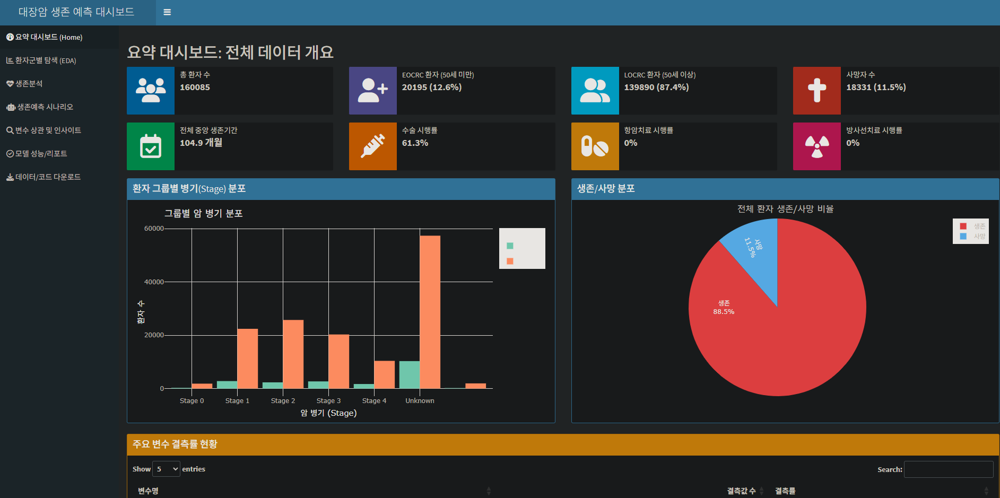
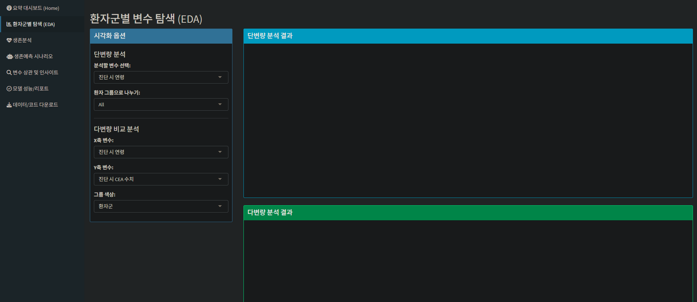
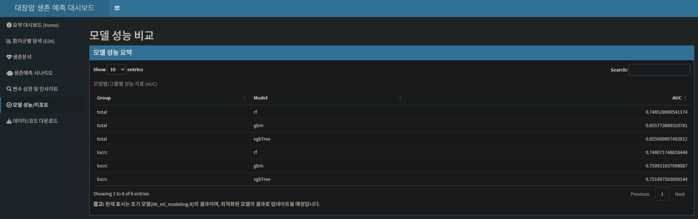

# 대장암 생존 예후 분석 프로젝트

## 1. 프로젝트 개요

본 프로젝트는 다기관에서 수집된 대장암 환자의 임상 데이터를 활용하여 생존에 영향을 미치는 주요 예후 인자를 식별하는 것을 목표로 합니다. 데이터 전처리, 탐색적 데이터 분석(EDA), 단변량 및 다변량 생존 분석을 체계적으로 수행합니다.

특히, 통계적 문제인 **완전 분리(Complete Separation)** 현상을 해결하기 위해 **퍼스 페널티 Cox 회귀(Firth's Penalized Cox Regression)**를 적용하여 안정적이고 신뢰도 높은 모델을 구축했습니다. 또한, 환자를 **조기 발병(EOCRC, 50세 이하)**과 **후기 발병(LOCRC, 50세 초과)** 그룹으로 나누어 연령에 따른 예후 인자의 차이를 비교 분석했습니다.

- 해당 프로젝트는 https://www.nature.com/articles/s41598-025-95385-0#Sec18 의 논문을 참고하여 만들어졌습니다.
- 해당 프로젝트의 데이터셋은 **국립암센터_대장암 다기관 암 임상 라이브러리 합성데이터_20250107**를 활용하여 만들었습니다.
- 해당 프로젝트는 https://github.com/bellfollow/Colorectal_cancer_survival_prediction 의 고도화 버전으로, 0.5 수준의 AUC를 보완하기 위해 만들어졌으며 이전 데이터셋과의 단순 데이터 크기 차이는 10배 이상 입니다.
- 이전 프로젝트의 문제였던 적은 표본수를 해결하였습니다.
- 대시보드를 활용하여 데이터를 전처리 결과를 한눈에 알아보기 편하게 만들어 지속적인 피드백을 진행했습니다.

## 2. 분석 파이프라인

분석은 `scripts/` 폴더 내의 R 스크립트를 순차적으로 실행하여 진행됩니다.

1.  `00_setup.R`: 분석에 필요한 R 패키지를 설치하고 로드합니다.
2.  `01_data_preprocessing.R`: 원본 데이터를 불러와 정제하고, 분석에 필요한 파생 변수를 생성합니다.
3.  `02_split_and_eda.R`: 데이터를 EOCRC와 LOCRC 그룹으로 분할하고 기초적인 탐색적 데이터 분석을 수행합니다.
4.  `03_advanced_eda.R`: 그룹 간 임상 특성을 비교하고, 주요 변수 간의 상관관계를 분석하는 등 심층 EDA를 수행합니다.
5.  `04_univariate_analysis.R`: 각 변수가 생존에 미치는 영향을 개별적으로 분석하는 단변량 Cox 회귀 분석을 수행하고, 유의미한 변수를 식별합니다.
6.  `05_multivariate_analysis.R`: 단변량 분석에서 선택된 변수들을 바탕으로 다변량 Cox 회귀 모델을 구축합니다. 퍼스 회귀를 적용하여 최종 예후 인자를 확정합니다.
7.  `06_ml_modeling.R`: Firth 회귀분석에서 도출된 유의미한 변수들을 사용하여 생존 예측 머신러닝 모델(Random Forest, GBM, XGBoost)을 구축하고 평가합니다.
8.  `shiny_app/` 폴더: 전체 분석 결과를 시각화하고 상호작용할 수 있는 R Shiny 대시보드를 구현합니다.

## 3. 주요 분석 결과

-   **공통 핵심 예후 인자**: 모든 환자 그룹에서 **종양의 병기(N 병기, M 병기)**가 생존을 예측하는 가장 강력한 인자였습니다.
-   **MSI 상태의 중요성**: **MSI 상태**는 나이와 무관하게 매우 강력하고 독립적인 예후 예측 인자임이 재확인되었습니다. 특히 `MSI-High`는 좋은 예후와 관련이 깊습니다.
-   **연령의 차별적 영향**: **연령**은 후기 발병(LOCRC) 그룹에서만 유의미한 위험 인자였으며, 조기 발병(EOCRC) 그룹에서는 뚜렷한 영향력이 없었습니다.
-   **조기 발병 암(EOCRC)의 공격성**: 림프절 전이가 발생했을 때, EOCRC 그룹의 위험도(HR)가 LOCRC 그룹보다 월등히 높아 조기 발병 암의 공격적인 특성을 시사했습니다.

상세한 분석 결과와 임상적 해석은 `docs/05_multivariate_analysis_total.md` 문서에 정리되어 있습니다.

## 4. 프로젝트 구조

```
.
├── data/              # 원본 및 전처리된 데이터
├── docs/              # 분석 과정 및 결과에 대한 상세 문서
├── results/           # 분석 과정에서 생성된 시각화 자료 및 결과 파일
├── scripts/           # 00부터 06까지의 분석 R 스크립트
├── shiny_app/         # 분석 결과를 시각화하는 대시보드 애플리케이션
└── README.md          # 프로젝트 요약 파일
```

## 5. 재현 방법

1.  `data/` 폴더에 원본 데이터셋을 위치시킵니다.
2.  `scripts/` 폴더의 R 스크립트를 `00_setup.R`부터 `06_ml_modeling.R`까지 순서대로 실행합니다.
3.  모든 결과물은 `results/` 폴더에 저장되며, 최종 보고서는 `docs/` 폴더에서 확인할 수 있습니다.

본 프로젝트는 다기관 대장암 임상 데이터를 통합 분석하여, 환자의 생존 예후에 영향을 미치는 주요 인자를 규명하는 것을 목표로 합니다. 특히 조기 발병(EOCRC, 50세 이하)과 후기 발병(LOCRC, 50세 초과) 대장암의 임상적 특성과 예후 인자를 비교 분석하는 데 중점을 둡니다.
- Python과 R을 섞어 만드려고 하였으나 Python의 ML과정에 맞는 추가적인 데이터 전처리가 필요해 R의 통합으로 진행하는 것이 좋아보여 R과 R_shiny로 만들었습니다. 
- R Shiny 대시보드를 통해 데이터 전처리 결과와 환자 특성, 생존 분석, 모델 예측 결과를 시각적으로 탐색하고 상호작용할 수 있도록 하여 지속적인 분석과 피드백을 용이하게 했습니다. 
## 📊 주요 분석 결과

- **병기(Tumor Stage)**: 모든 환자 그룹에서 생존 예후를 결정하는 가장 압도적인 요인입니다. (4기 vs 0기, 사망 위험 약 6.5배)
- **수술(Surgery)**: 가장 일관되고 강력한 생존 보호 인자로, 모든 그룹에서 사망 위험을 크게 감소시켰습니다.
- **조기 발병(EOCRC) vs 후기 발병(LOCRC) 특성**: 
  - **EOCRC**: `성별(남성)`이 뚜렷한 생존 이점(사망 위험 36% 감소)을 보였으나, `나이` 자체는 예후에 큰 영향을 주지 않았습니다.
  - **LOCRC**: `나이`가 유의미한 위험 인자였으며, `진단 시 CEA 수치` 또한 중요한 예후 예측 인자였습니다.
- **치료의 역설 규명**: 병기 보정 전 항암/방사선 치료가 사망 위험을 높이는 것처럼 보였던 현상은, 진행성 암 환자들이 해당 치료를 더 많이 받는 데서 기인한 **'교란 효과(Confounding effect)'** 임을 통계적으로 확인했습니다.

## 🚀 시작하기

### 사전 요구사항

- R (version 4.2 이상)
- RStudio (권장)
- R 패키지: tidyverse, survival, caret, shiny, shinydashboard, plotly, DT, survminer, ggplot2

### 설치 및 설정

1.  **저장소 복제**
2.  **데이터 배치**: 원본 CSV 파일들을 `data/raw/` 폴더 내 기관별 하위 폴더에 배치합니다.
3.  **패키지 설치**: R 콘솔에서 아래 명령어를 실행하여 필요한 모든 패키지를 설치합니다.
    ```R
if (!require("pacman")) install.packages("pacman")
pacman::p_load(tidyverse, caret, survival, survminer, ggcorrplot, gtsummary, conflicted, 
               shiny, shinydashboard, plotly, DT, ggrepel, reshape2)
```

### 🔬 분석 파이프라인 실행

`scripts/` 폴더의 R 스크립트를 아래 순서대로 실행하여 전체 데이터 처리 및 분석 과정을 재현할 수 있습니다.

```R
# R 콘솔 또는 RStudio에서 실행
source("scripts/01_data_preprocessing.R")
source("scripts/02_split_and_eda.R")
source("scripts/03_advanced_eda.R")
source("scripts/04_univariate_analysis.R")
source("scripts/05_multivariate_analysis.R")
source("scripts/06_ml_modeling.R")

# Shiny 대시보드 실행
setwd("shiny_app/")
shiny::runApp()
```

## 📂 프로젝트 구조

```
.
├── data/                 # 원본, 중간, 최종 데이터 (Git 관리 제외)
├── docs/                 # 분석 단계별 상세 문서
│   └── *.md              # 각 분석 과정 요약 문서
├── results/              # 분석 결과물 (CSV, plot 등, Git 관리 제외)
├── scripts/              # 분석 R 스크립트
└── README.md             # 프로젝트 개요 및 가이드
```

## 📜 스크립트 개요

- **`01_data_preprocessing.R`**: 여러 기관의 원본 데이터를 통합하고 정제하여 분석용 데이터셋을 생성합니다. ([문서](./docs/01_data_preprocessing_documentation.md))
- **`02_split_and_eda.R`**: 데이터를 훈련/검증용으로 분할하고 기초 탐색적 데이터 분석(EDA)을 수행합니다. ([문서](./docs/02_split_and_eda_documentation.md))
- **`03_advanced_eda.R`**: 카플란-마이어 생존 곡선 등 심층 EDA를 수행합니다. ([문서](./docs/03_advanced_eda_summary.md))
- **`04_univariate_analysis.R`**: 단변량 콕스 회귀 분석을 통해 각 변수의 독립적인 예후 연관성을 평가합니다. ([문서](./docs/04_univariate_analysis_summary.md))
- **`05_multivariate_analysis.R`**: 다변량 콕스 회귀 분석을 통해 여러 변수를 보정한 상태에서의 핵심 예후 인자를 도출합니다. ([문서](./docs/05_multivariate_analysis_total.md))
- **`06_ml_modeling.R`**: Firth 회귀분석에서 도출된 통계적으로 유의미한 변수들을 사용하여 머신러닝 모델(Random Forest, GBM, XGBoost)을 구축하고 AUC로 성능을 평가합니다. ([문서](./docs/06_ml_modeling_progress.md))
- **`shiny_app/`**: 데이터 탐색, 생존 분석, 모델 성능을 시각화하는 대화형 R Shiny 대시보드를 구현합니다. ([문서](./docs/07_shiny_dashboard.md))

## 머신러닝 모델링 결과

### 모델 구현 및 평가
- **구현 목표**: Firth 회귀분석에서 도출된 유의미한 변수들을 사용하여 그룹별(total, EOCRC, LOCRC) 생존 예측 모델 구축
- **사용된 알고리즘**: Random Forest, Gradient Boosting Machine(GBM), XGBoost
- **모델 훈련 방식**: 5-fold 교차 검증, SMOTE를 통한 클래스 불균형 처리
- **평가 지표**: AUC(Area Under the ROC Curve)

### 주요 성능 결과
|그룹|모델|AUC|
|---|---|---|
|total|Random Forest|0.747|
|total|GBM|0.656|
|total|XGBoost|0.656|
|locrc|Random Forest|0.746|
|locrc|GBM|0.751|
|locrc|XGBoost|0.752|

- EOCRC 그룹의 경우, Firth 회귀분석에서 통계적으로 유의미한 예측 변수가 없어 모델링이 수행되지 않았습니다.
- 이전 프로젝트의 0.5 수준의 AUC보다 개선된 성능을 보였으며, 특히 LOCRC 그룹에서 XGBoost와 GBM 모델이 0.75 이상의 좋은 성능을 달성했습니다.


## 대시보드 실행 화면


